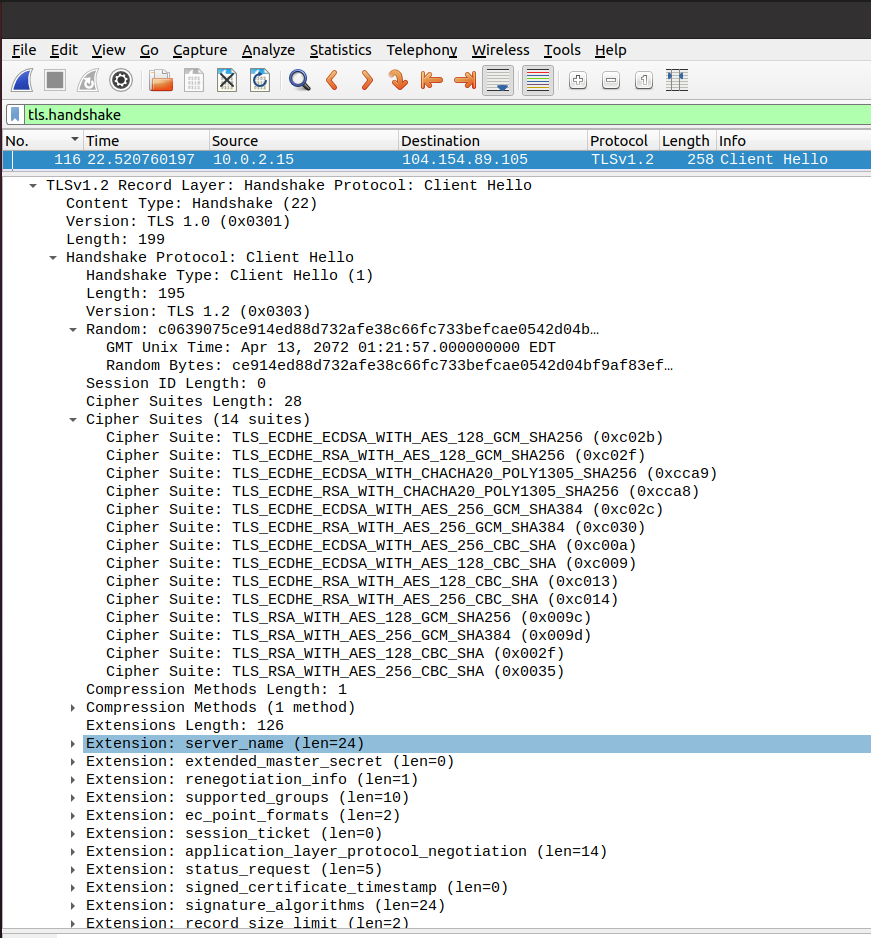
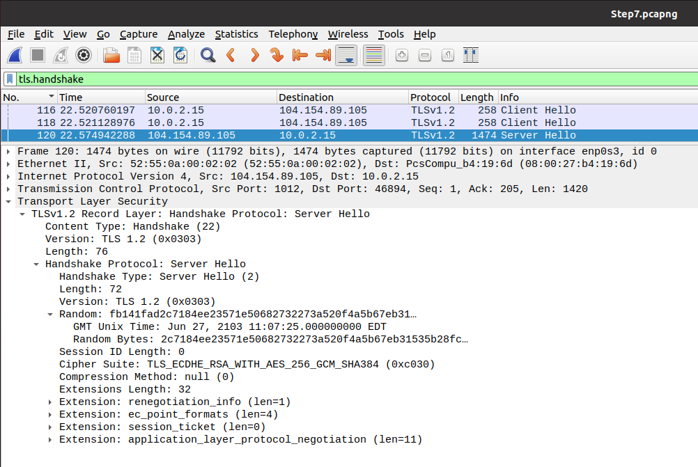
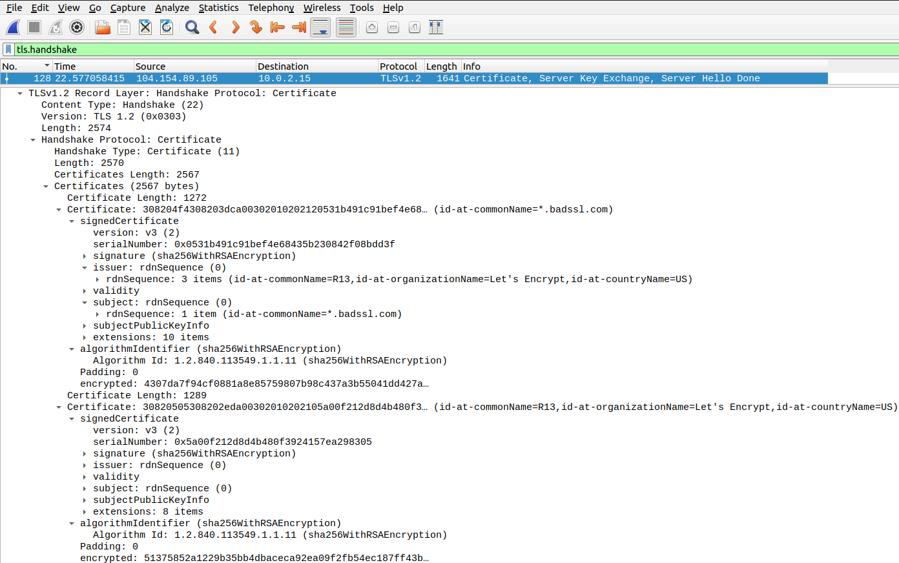
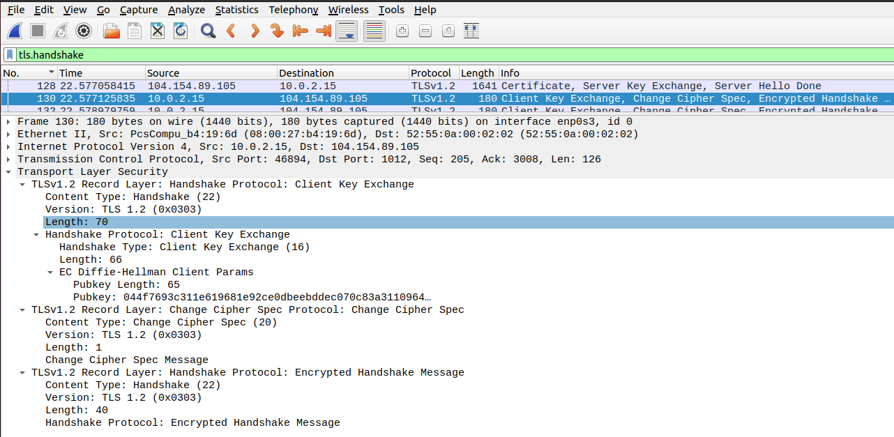
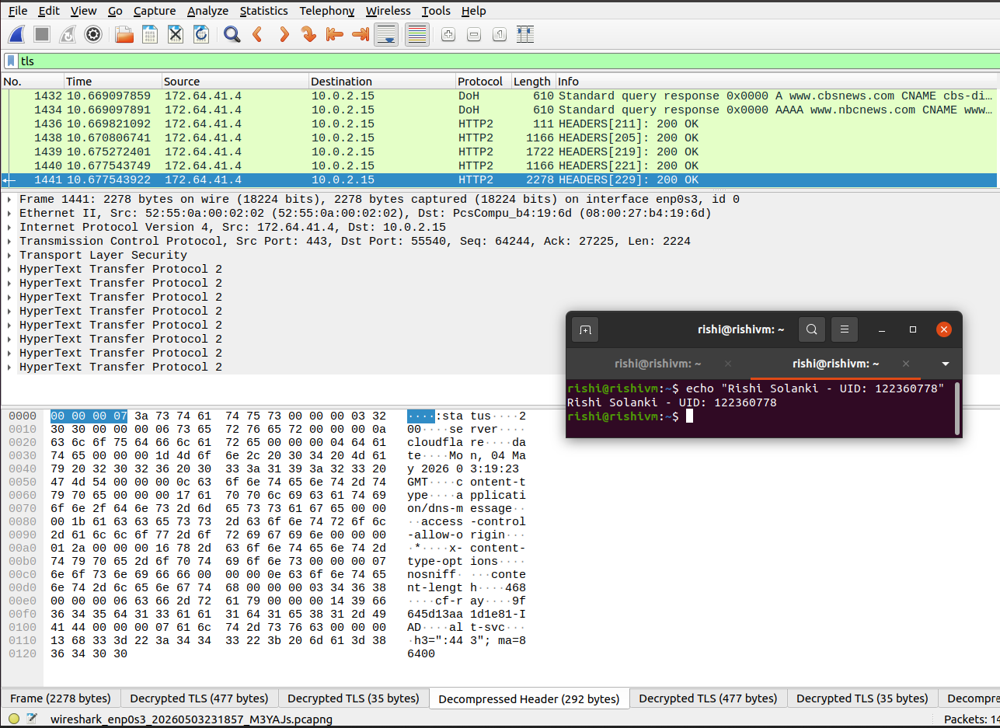
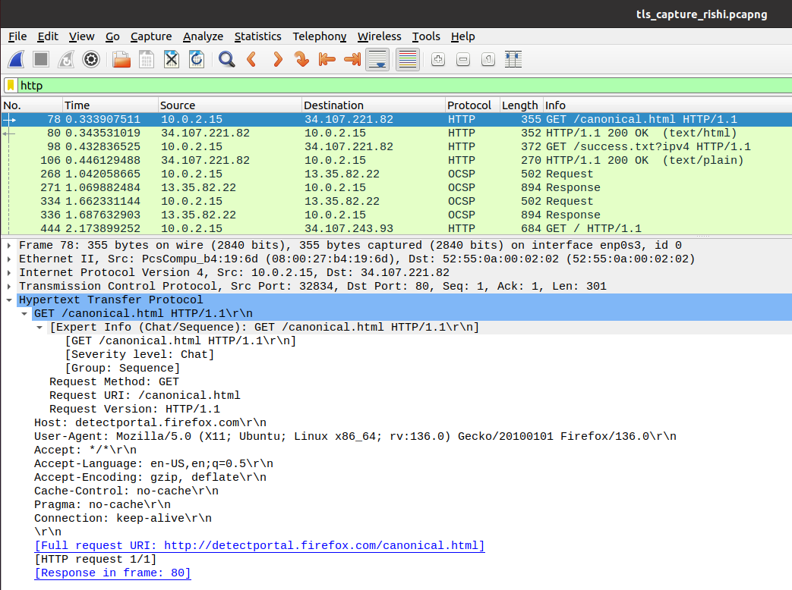
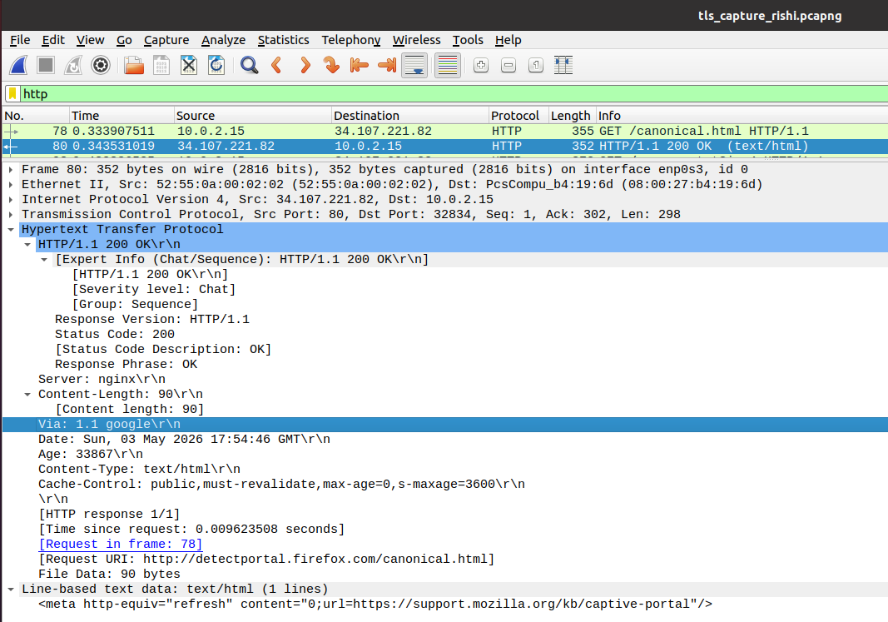

# tls-security-analysis

Deep analysis of a TLS 1.2 handshake, certificate validation, cipher suite negotiation, ECDHE key exchange, and TLS traffic decryption using Wireshark and SSLKEYLOGFILE.

---

## Overview

This project analyzes the complete TLS 1.2 connection establishment process between a Linux client and a remote HTTPS server. Using Wireshark packet captures, the TLS handshake was examined step-by-step to understand protocol negotiation, certificate validation, key exchange mechanisms, and encrypted application-layer communication.

The project also demonstrates HTTPS traffic decryption using exported TLS session secrets, allowing inspection of HTTP requests, HTTP responses, and HTTP/2 traffic that would normally remain encrypted.

---

## Skills Demonstrated

* Network Security
* TLS 1.2 Analysis
* HTTPS Traffic Inspection
* Wireshark Packet Analysis
* Public Key Infrastructure (PKI)
* X.509 Certificate Validation
* ECDHE Key Exchange
* Forward Secrecy
* HTTP/HTTPS Protocol Analysis
* DNS-over-HTTPS (DoH)

---

## Tools Used

* Wireshark
* Firefox
* Ubuntu Linux
* TLS 1.2
* SSLKEYLOGFILE
* OpenSSL
* badssl.com

---

## Repository Structure

```text
tls-security-analysis/
│
├── README.md
├── captures/
│   └── tls_capture.pcapng
│
└── screenshots/
    ├── 01-ClientHello.png
    ├── 02-ServerHello.png
    ├── 03-Certificate.png
    ├── 04-ClientKeyExchange.png
    ├── 05-TLSDecryption.png
    ├── 06-HTTPRequest.png
    └── 07-HTTPResponse.png
```

---

## TLS Handshake Workflow

```text
Client
  │
  ├── Client Hello
  │
Server
  ├── Server Hello
  ├── Certificate
  ├── Server Key Exchange
  │
Client
  ├── Client Key Exchange
  ├── Change Cipher Spec
  ├── Finished
  │
Server
  ├── Change Cipher Spec
  ├── Finished
  │
Encrypted Application Data
```

---

## Client Hello Analysis



The TLS session begins with a Client Hello message, where the client advertises supported protocol versions, cipher suites, and TLS extensions.

### Key Observations

* TLS 1.2 requested by the client
* Client-generated random value included
* Multiple cipher suites offered
* Session negotiation initiated

---

## Server Hello Analysis



The server responds by selecting the protocol version and cipher suite used for the session.

### Negotiated Cipher Suite

```text
TLS_ECDHE_RSA_WITH_AES_256_GCM_SHA384
```

This suite provides:

* ECDHE for ephemeral key exchange
* RSA for server authentication
* AES-256-GCM for encryption
* SHA-384 for integrity protection

---

## Certificate Validation



The server presents its X.509 certificate chain to prove ownership of the domain.

### Certificate Details

| Field            | Value         |
| ---------------- | ------------- |
| Subject          | *.badssl.com  |
| Issuer           | Let's Encrypt |
| Certificate Type | X.509         |

### Security Significance

The certificate chain establishes trust between the client and server and prevents impersonation attacks.

---

## Client Key Exchange



The negotiated cipher suite uses Elliptic Curve Diffie-Hellman Ephemeral (ECDHE) for key exchange.

### Key Findings

* Ephemeral public keys exchanged
* Shared secret generated independently by both parties
* Session keys derived without transmitting secrets
* Forward secrecy enabled

### Why Forward Secrecy Matters

Even if a server's private key is compromised in the future, previously captured TLS sessions cannot be decrypted.

---

## TLS Traffic Decryption



TLS session secrets were exported using:

```bash
export SSLKEYLOGFILE=~/tls_keys.log
```

Wireshark was configured to use the exported secrets, allowing encrypted TLS traffic to be decrypted and analyzed.

### Decrypted Data Observed

* HTTP Requests
* HTTP Responses
* HTTP/2 Headers
* DNS-over-HTTPS Traffic

---

## HTTP Request Analysis



After TLS decryption, application-layer traffic became visible.

### Observed Fields

* Request Method
* Request URI
* Host Header
* User-Agent

Example:

```http
GET /canonical.html HTTP/1.1
Host: detectportal.firefox.com
```

---

## HTTP Response Analysis



The corresponding server response was successfully decrypted and inspected.

### Observed Fields

* HTTP Status Code
* Content-Type
* Content-Length
* Response Body

Example:

```http
HTTP/1.1 200 OK
Content-Type: text/html
```

---

## Technical Findings

### TLS Version

The client and server successfully negotiated TLS 1.2.

### Cipher Suite Selection

The server selected:

```text
TLS_ECDHE_RSA_WITH_AES_256_GCM_SHA384
```

providing authenticated encryption and forward secrecy.

### Certificate Trust

The certificate chain was successfully validated through a trusted public Certificate Authority.

### Key Exchange

ECDHE was used to establish shared session keys while preventing long-term key compromise from exposing historical traffic.

### HTTPS Visibility

Using exported session secrets, encrypted TLS traffic was decrypted and inspected at the application layer.

---

## Security Concepts Demonstrated

### Public Key Infrastructure (PKI)

TLS relies on trusted Certificate Authorities to verify server identities and establish trust.

### Forward Secrecy

ECDHE generates unique session keys for every connection, preventing retrospective decryption of captured traffic.

### Authenticated Encryption

AES-GCM provides both confidentiality and integrity protection for application data.

### Secure Transport

TLS protects web traffic against:

* Eavesdropping
* Tampering
* Man-in-the-Middle Attacks
* Session Hijacking

---

## Key Takeaways

* TLS negotiation begins with Client Hello and Server Hello messages.
* Certificates provide server authentication through trusted Certificate Authorities.
* ECDHE enables secure key exchange with forward secrecy.
* AES-GCM protects application data in transit.
* TLS traffic can be decrypted for analysis when session secrets are available.
* Wireshark provides visibility into both encrypted and decrypted protocol operations.

---

## References

* RFC 5246 – TLS 1.2
* Wireshark Documentation
* OpenSSL Documentation
* badssl.com

---

## Author

Rishi Solanki

M.Eng Cybersecurity Engineering

University of Maryland
